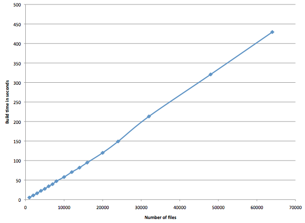

emk
===

A Python-based build tool.

Requires Python 2.6 or higher; Python 3+ is supported. Currently supports OS X, Linux, and Windows.
Compiling and linking module support is provided for gcc/g++ and MSVC.

Features
--------

 * Fast builds. emk is designed to use multiple threads, and uses as many threads as you have processors
   by default. Build time scales linearly with the number of executed build rules.
 * No installation required.
 * Designed for correct recursive builds (ie, building in multiple directories that are dependent on
   each other). Note that emk only uses a single process for recursive builds; it does not spawn a new
   process for each directory. This allows a global view of the build graph so that correctness is easy.
 * Includes a module system for common build rules. Comes with modules for building C, C++, and Java.
 * Build rules are written in Python, so anything that Python can do can be done while building. It is
   easy to write new build rules.
 * Allows specification of build rules that produce multiple files (eg code generation), as well as rules
   that do not produce any files.
 * Allows new build rules to be added after building has started. This allows (for example) autodetection
   of executables based on the compiled object file (by parsing the nm output) rather than trying to parse
   source code.
 * Hierarchical build configuration system, so you can configure build settings (such as compiler flags)
   for a given project or directory easily.
 * Fancy output formatting system - can output plain text, coloured/styled console output (using ANSI escape codes),
   or HTML (suitable for CSS styling).

Installation
------------

If desired, you can run `(sudo) setup.py install` to create a symlink at /usr/bin/emk pointing to
the emk script in the current directory (on *nix platforms) or add it to the PATH (on Windows). You
can run `(sudo) setup.py uninstall` to remove /usr/bin/emk if it is a symlink to the emk script in
the current directory (on *nix platforms), or to remove it from the PATH (on Windows).

Note that emk does not require installation; it can be run directly from any directory. The only requirement
is that the emk script and the emk.py module must be in the same directory. Typically that directory
would also contain a 'modules' directory containing the various emk modules, and optionally a 'config'
directory containing the global configuration (emk_global.py) for the emk instance.

Documentation
-------------

Run `emk -h` for basic usage information.

**[Tutorial](tutorial/tutorial.md)**  
**[Manual](docs/manual.md)**
### Modules
 * [Utility Module](docs/modules/utils.md)
 * [C/C++ Module](docs/modules/c.md)
 * [Link Module](docs/modules/link.md)
 * [Java Module](docs/modules/java.md)

There are also docstrings with detailed documentation for all public API functions/properties in the emk source code.

Performance
-----------

Here is a graph of build time vs number of files compiled:

Note the linear relationship. There is some bumpiness which is probably due to filesystem caching effects.
This test involved emk autodiscovering and compiling a set of generated C files. Each C file contains one function,
and includes a header that is specific to that C file, a header that is shared amongst groups of 100 C files, and a global
header that is shared by all C files. The C files are divided into directories each containing 1000 C files; this is to
avoid some performance issues with HFS+ when directories contain large numbers of files.

You can reproduce these results using the scripts in the `speed-test` directory. First, change to the `speed-test` directory.
Then, run `./generate.py` to generate the test files. Once that is complete, run `./run.py` to run the speed test. This will take
a long time. Once the speed test is completed, the results will be in `results.txt`. Each line of the results is
`<number of files compiled> <build time in seconds>`. You can then run `./cleanup.py` to remove the generated test files.
